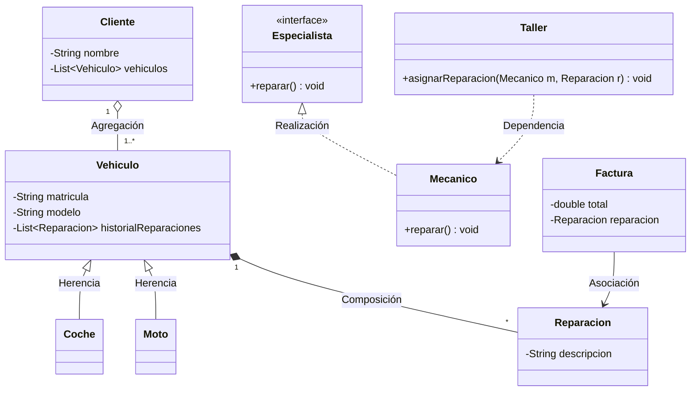

```mermaid
classDiagram
    class Cliente {
        -String nombre
        -List~Vehiculo~ vehiculos
    }
    
    class Vehiculo {
        -String matricula
        -String modelo
        -List~Reparacion~ historialReparaciones
    }
    
    class Coche {
    }
    
    class Moto {
    }
    
    class Reparacion {
        -String descripcion
    }
    
    class Especialista {
        <<interface>>
        +reparar() void
    }
    
    class Mecanico {
        +reparar() void
    }
    
    class Taller {
        +asignarReparacion(Mecanico m, Reparacion r) void
    }

    %% Relaciones
    Vehiculo <|-- Coche : Herencia
    Vehiculo <|-- Moto : Herencia
    Cliente "1" o-- "1..*" Vehiculo : Agregación
    Vehiculo "1" *-- "*" Reparacion : Composición
    Especialista <|.. Mecanico : Realización
    Taller ..> Mecanico : Dependencia
    
    class Factura {
        -double total
        -Reparacion reparacion
    }
    Factura --> Reparacion : Asociación
```